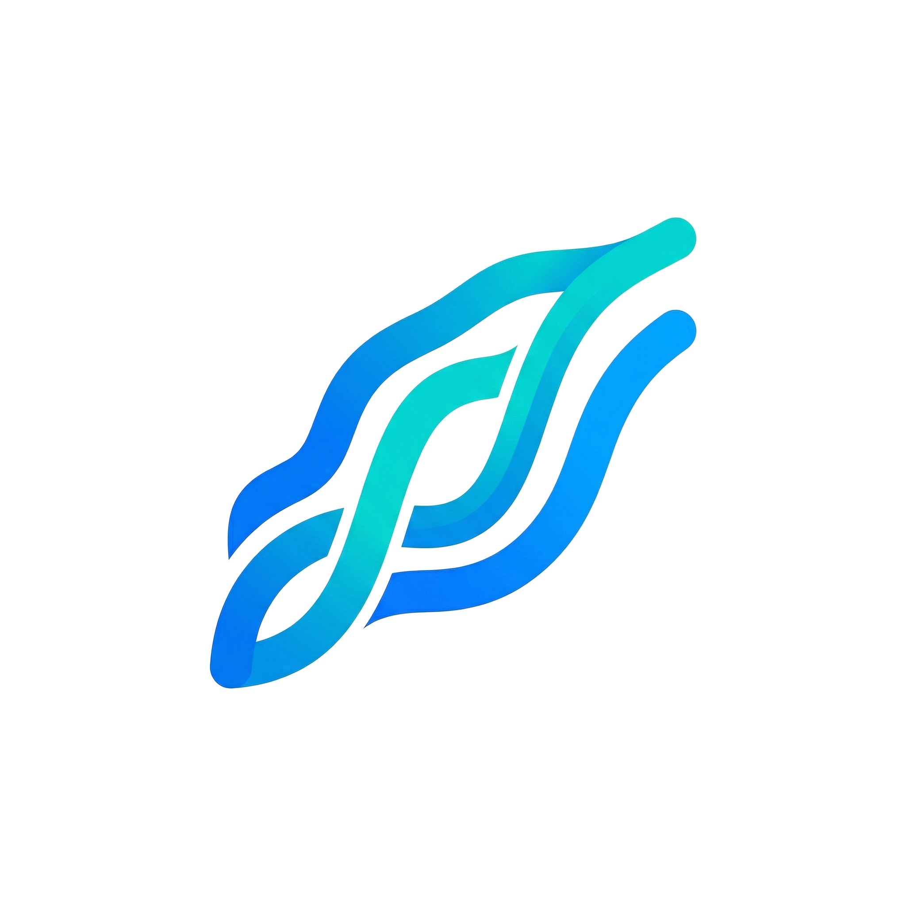

<p align="center">
  
</p>

<h1 align="center">Currents</h1>

<p align="center">
  <b>An offline-first fishing companion for iOS.</b><br>
  Built in Swift, designed for anglers who fish where the cell signal doesn't reach.
</p>

<p align="center">
  <a href="#screenshots">Screenshots</a> ·
  <a href="#features">Features</a> ·
  <a href="#community-crews--tournaments">Community</a> ·
  <a href="#architecture">Architecture</a> ·
  <a href="#build">Build</a> ·
  <a href="#roadmap">Roadmap</a> ·
  <a href="#license">License</a>
</p>

---

## Overview

Currents is an on-device-first fishing app: log catches, analyse gear, track spots, forecast the bite, and identify species on-device. By default nothing leaves your phone — no account required, no tracking. Social networking is **entirely optional**: if you choose to join the Community, a limited set of data (leaderboard catches, your angler profile, friend requests, crew posts, and spots you explicitly share) syncs through Apple's CloudKit so friends can see it. Don't join and the app stays fully local.

The app is written in **Swift 5.10 / SwiftUI**, targeting **iOS 26** with the Liquid Glass design language, and persists everything through **GRDB.swift** on SQLite. Weather data is fetched from the free [Open-Meteo](https://open-meteo.com) API when online and cached aggressively for offline use. Fish species identification runs on-device via **CoreML**. An **Apple Watch** companion app and home-screen **widgets** ride along.

## Screenshots

Captured automatically in CI with rights-clean demo data — see [`.github/workflows/screenshots.yml`](.github/workflows/screenshots.yml).

| Today | Explore | Catches | Field Guide | Community |
|---|---|---|---|---|
|  |  |  |  |  |

## Features

### Today — the bite at a glance
- **Bite score hero** — a 0–100 score for right now, with a tappable day timeline: pick any hour and see its score, delta vs now, and why.
- **Best Windows** — the day's hottest bite windows, clickable for in-place hour detail.
- **What to Throw** — a lure engine that reads water clarity, temperature, light and conditions and ranks lures/baits, flagging the ones you actually own.

### Catch logging
- **Photo-first gallery** — catches display as a 2-up photo gallery (species artwork stands in when there's no photo), switchable to a classic list. Favourite and released badges float on the cards; swipe (or long-press) to favourite or delete.
- **Pin-drop locations** — pick a spot anywhere on the map, not just your current GPS fix.
- **Photo capture** with inline species suggestion from the on-device classifier.
- **Metadata that matters** — weight, length, water temperature, gear used, notes, forecast score at the moment of capture.
- **Private by default** — nothing leaves the device unless you opt into the Community. A per-catch privacy radius obfuscates any coordinates you do share.

### Bite forecast
The `ForecastEngine` computes a 0–100 bite score from a weighted combination of factors that actually predict fish behavior:

| Factor | Weight | Source |
|---|---|---|
| Barometric pressure trend | 15 | Open-Meteo hourly pressure (+ on-device barometer) |
| Solunar major / minor windows | 15 | On-device astro calc (no API) |
| Tide phase | 15 | Simplified harmonic prediction |
| Time of day (golden hours) | 15 | Sunrise / sunset from location |
| Pressure level | 10 | Open-Meteo current |
| Moon phase | 10 | Synodic cycle from 1999-12-25 new moon |
| Wind | 8 | Open-Meteo current |
| Water temp vs species optimum | 7 | Bundled species table |
| Spawning zone activity | 5 | Bundled seed data |

Each factor is normalised 0–1 and combined additively, so the same engine works for freshwater bass and saltwater kingfish just by swapping the species profile. Every component on the Full Forecast page is tap-to-explain.

### Location inspector
Tap anywhere on the map and Currents shows you **why that spot is (or isn't) worth a cast**: live weather, a full bite-score breakdown, probable fishing spots ranked by local catch history, and nearby saved waypoints. Save the tap as a new spot in one button press.

### Offline maps
Apple Maps as the default renderer, with bathymetry-aware tile overlays where available. Optional layers: nautical charts, rain radar, wind field, currents. Downloadable PMTiles regions for air-gapped use are wired through `MapManager`.

### On-device species identification
A CoreML classifier runs inference locally — no images leave the device — with test-time augmentation, a regional thermal prior, and a "not sure" guardrail. See [`docs/ml.md`](docs/ml.md) for the model pipeline and how to swap in your own trained weights.

### Fish — field guide & seasons
- **Field Guide** — a Pokédex-style collection of 1,500+ species with the app's own artwork; catching one fills it in. Search, rarity filters, caught-only view.
- **Seasons** — what's biting this month, with habitat filters, water-temp estimates and per-species season windows.

### Sessions & trips
- **GPS-tracked sessions** — route, duration, catch limits, multi-day trips, and a live activity on the lock screen.
- **Trip planner** — plan sessions with a date, a forecast-anywhere pin, a collapsible day-by-day bite outlook (built for two-week trips), and a tick-off gear checklist.
- **Session history** labels every trip: tournament team, crew trip, or shared trip.

### Gear & tackle
- **Tackle box with photos** — snap your actual gear; loadouts track which rig caught what.
- **Gear catalog** — browsable lure/tackle catalog, synced quietly, works offline.
- **Knots & rigs** — illustrated knot library with categories.
- **Licence wallet** — store fishing licences, OCR the expiry, get reminded before they lapse. Size/bag regulations checked per catch.

### Analytics & achievements
- Personal bests per species, monthly trend, best hours heatmap, gear effectiveness, spot productivity.
- **Achievements** — 27 badges across five rarity tiers, shown on your profile and (computed from public data) on friends' profiles.

### Apple Watch & widgets
- Log a catch from your wrist — species by voice, anytime.
- Hourly bite-score complication, "fish on" complication, next-session widget, quick-log widget.
- The watch follows the phone's app icon/theme.

## Community, crews & tournaments

Everything social is **opt-in** and rides on the user's own iCloud (CloudKit public database) — no accounts, no passwords, no server to run.

- **Friends** — add by 6-character code, compare on leaderboards (most fish / heaviest / longest), browse rich angler profiles with achievements, and share spots privately — exact or approximate, per friend.
- **Crews** — a persistent circle with a shared catch feed. Catches auto-post (per-crew toggle), crewmates react with a tap, posts carry captions, and moderation is real: **Captain > Mate > Admin > Member** roles with promotion, kick, post deletion, captaincy transfer, and a crew banner + photo/emoji icon.
- **Live group trips** — fish together in real time: shared feed, member standings with a podium, join mid-trip from the crew page, invite links, and host-ends-for-everyone semantics.
- **Tournaments** — admins start a points-scored competition (10/fish, +1/kg, +5 first-of-species per team). Teams are live GPS sessions; standings update live; highlights track most fish / biggest / first; the admin declares the winner (top team highlighted); full tournament history per crew.
- **Push notifications** — reactions, crew posts, trips going live and friend requests arrive as real APNs push via CloudKit subscriptions, with silent feed pre-warming so the app opens current.
- **Performance** — every community screen renders instantly from a disk cache and refreshes in the background; batched profile fetches; paginated crew feeds (1,000-post crews stay snappy).

## Architecture

```
┌──────────────────────────────────────────┐
│  SwiftUI Views  (Features/*)             │
└──────────────┬───────────────────────────┘
               │
┌──────────────▼───────────────────────────┐
│  ViewModels / @Observable AppState       │
└──────────────┬───────────────────────────┘
               │
┌──────────────▼───────────────────────────┐
│  Repositories  (Core/DB/Repositories/*)  │
└──────────────┬───────────────────────────┘
               │
┌──────────────▼───────────────────────────┐
│  GRDB.swift  →  SQLite                   │
└──────────────────────────────────────────┘

     Cross-cutting services
     ─────────────────────
     WeatherService     (actor, Open-Meteo cache)
     ForecastEngine     (pure value type, deterministic)
     SolunarEngine      (astro, no network)
     TideEngine         (harmonic prediction)
     LureEngine         (conditions → ranked lures)
     FishClassifier     (actor, CoreML + Vision)
     CommunityService   (CloudKit public DB, opt-in social)
     TripTracker        (GPS sessions + Live Activity)
     BarometerService   (on-device pressure trend)
     LocationManager    (CoreLocation wrapper)
     MapManager         (MapKit + PMTiles regions)
```

### Design rules

1. **Every screen reads from local SQLite.** No network calls on the UI thread, ever.
2. **Every write goes to local SQLite first.** The user sees instant success; sync happens later.
3. **Community screens render from disk, refresh in the background.** Push bumps a shared revision that every open screen watches — no pull-to-refresh anywhere.
4. **Pure functions for anything forecast-related.** `ForecastEngine`, `SolunarEngine` and `LureEngine` take values in, return values out. Trivial to test, deterministic, no hidden state.
5. **Actors for anything async.** `WeatherService` and `FishClassifier` are actors so concurrent callers serialise cleanly without locks.
6. **Seed data is compiled in**, not bundled as resources. Embedding JSON as Swift string literals removes a whole class of "works locally, crashes in CI" bugs. See `Core/DB/SeedData/`.

See [`docs/architecture.md`](docs/architecture.md) for the full breakdown.

## Repo layout

```
currents/
├── ios/                          Xcode project (generated via XcodeGen)
│   ├── Currents/
│   │   ├── App/                  @main, AppState, AppDelegate (push), Info.plist
│   │   ├── Core/                 DB, Weather, ML, Astro, Maps, CloudKit, Theme
│   │   ├── Features/             Today, Map, Catch, Forecast, Species, Gear,
│   │   │                         Trip, Community (crews/tournaments), Profile
│   │   └── Resources/            Assets.xcassets, Data/
│   ├── CurrentsWatch/            Apple Watch companion (complications, voice log)
│   ├── CurrentsWidgets/          Home-screen widgets
│   ├── CloudKit/schema.ckdb      CloudKit schema (import + deploy to Production)
│   ├── Tests/                    XCTest unit tests
│   └── project.yml               XcodeGen spec
├── ml/                           Model training + CoreML conversion
├── scripts/                      Seed-data generators (Python → Swift)
├── docs/                         Architecture, data model, ML notes
├── .github/workflows/            iOS build + TestFlight, screenshots, ML pipelines
├── Makefile                      Common commands
└── README.md                     You are here
```

## Build

### Requirements
- macOS with Xcode 16 or newer
- [XcodeGen](https://github.com/yonaskolb/XcodeGen) (`brew install xcodegen`)
- iOS 26 simulator runtime

### Generate the project & run

```bash
cd ios
xcodegen generate
open Currents.xcodeproj
```

Or from the command line:

```bash
make ios
```

### CI / TestFlight / sideloaded IPA

Every push to `master` builds, tests, archives and uploads to **TestFlight** via GitHub Actions ([.github/workflows/ios.yml](.github/workflows/ios.yml)). The same run also produces an unsigned `.ipa`, fakesigned with `ldid`, compatible with sideloading tools like [Sideloader](https://sideloader.app) and TrollStore — download the `Currents-IPA` artifact from any green build, no paid Apple Developer account required.

App Store screenshots regenerate on demand from [.github/workflows/screenshots.yml](.github/workflows/screenshots.yml): the simulator launches in screenshot mode, seeds rights-clean demo data (the app's own fish artwork, fictional crew), and captures each tab at 6.9" full resolution.

Community features additionally require the CloudKit schema: import [`ios/CloudKit/schema.ckdb`](ios/CloudKit/schema.ckdb) in the CloudKit Console and deploy to Production.

## Roadmap

- [x] Catch logging with pin-drop locations, photos, gear
- [x] Bite forecast engine (pressure / solunar / tide / weather)
- [x] Location inspector (tap-to-analyse anywhere on the map)
- [x] Personal bests, trip logging, species guide
- [x] Unsigned IPA builds via CI, plus TestFlight delivery
- [x] On-device CoreML fish classifier shipped with the app
- [x] Optional Community — leaderboards, friends, shared spots (opt-in, obfuscated locations)
- [x] Crews with roles, feeds, reactions and moderation
- [x] Tournaments — points-scored team competitions on live GPS sessions
- [x] Push notifications over CloudKit subscriptions (no server)
- [x] Apple Watch app + complications, home-screen widgets
- [x] What to Throw lure engine + Best Windows
- [ ] PMTiles bundled bathymetry regions
- [ ] Optional self-hostable sync layer (PowerSync)

## Contributing

Issues and PRs welcome. See [`docs/contributing.md`](docs/contributing.md) for the commit-message conventions, test expectations, and the preferred development loop.

## License

MIT — see [`LICENSE`](LICENSE).
